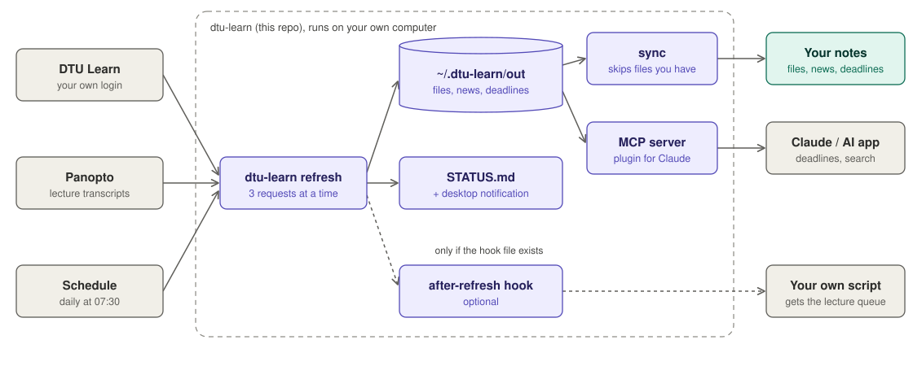

# dtu-learn: DTU Learn MCP server and API client for AI assistants

Use your **DTU Learn** courses with **Claude** and other AI assistants. dtu-learn is an **MCP server** and a
command-line **DTU Learn API** client: it downloads your own DTU Learn (Brightspace / D2L) courses to your
computer (slides, files, announcements, assignments, deadlines, grades and Panopto lecture transcripts), so
your AI can answer "what is due this week?" or "which slide explains attention?".

> **Unofficial.** A student project, not made or supported by DTU or D2L. Use it only with your own account
> and follow [DTU's rules](#dtu-rules). Everything stays on your computer: there is no server and no shared login.

<picture>
  <source media="(prefers-color-scheme: dark)" srcset="docs/architecture-dark.svg">
  
</picture>

## Install

You need a DTU account and Google Chrome (or Edge).

**Claude Code (recommended)**

```
/plugin marketplace add CarlSvejstrup/dtu-learn-mcp
/plugin install dtu-learn@dtu-learn
```

Restart Claude Code and ask: **"Set up DTU Learn for me."** It installs the tool and opens the DTU login.
You type your password and MFA in the browser yourself.

**Claude Desktop, Cursor, Codex and other MCP clients**

```bash
curl -LsSf https://astral.sh/uv/install.sh | sh          # uv, if you do not have it (Windows: see uv docs)
uv tool install git+https://github.com/CarlSvejstrup/dtu-learn-mcp
dtu-learn setup                                          # login, first download, connects your AI apps
```

Restart your AI app. To add the skills too: `npx skills add CarlSvejstrup/dtu-learn-mcp`.

## Use it

Ask your AI:

- "What is due this week, and have I handed it in?"
- "What is new on DTU Learn since yesterday?"
- "Which lecture in 02132 covers pipelining? Give me the slide page."
- "Search the deep learning lecture transcripts for 'batch norm'."
- "Give me my DTU week." / "Quiz me on the NLP slides."

**Fresh data is one question away:** say "refresh DTU Learn" and the MCP `refresh` tool downloads what changed.
If the DTU login has expired, the AI calls `login` and a browser window opens for you. Without an AI:
`dtu-learn scrape --current`.

## Optional extras

All off by default. Use the ones you want.

<details>
<summary><b>Daily auto-refresh</b>: every morning, with a notification when something is new</summary>

```bash
dtu-learn schedule install      # launchd (macOS), crontab (Linux) or Task Scheduler (Windows)
dtu-learn schedule status
dtu-learn schedule remove
```

It checks at 07:30 (or when the computer wakes) and refreshes at most once per 12 hours. After every check it
writes `~/.dtu-learn/STATUS.md`: result, whether you must log in, next refresh and what was new. Ask your AI
"what is the dtu-learn status?" to read it. When the login has expired you get a notification; run
`dtu-learn login`.
</details>

<details>
<summary><b>Sync into your notes</b>: copy new files and announcements into your own folders (e.g. Obsidian)</summary>

Copy `sync.example.json` to `~/.dtu-learn/sync.json` and map each course id (`dtu-learn courses --current`)
to a folder. `dtu-learn sync` copies new or changed files, never deletes, and skips a file whose content you
already keep elsewhere in that folder's parent. The MCP `refresh` tool and the schedule sync automatically
once `sync.json` exists.

If a destination is `<course>/material/learn`, sync also writes `<course>/announcements.md` (all announcements,
newest first) and adds upcoming deadlines under `## Next` in `<course>/backlog.md`. `--no-vault` turns that off.
</details>

<details>
<summary><b>After-refresh hook</b>: run your own script when new lecture slides arrive</summary>

Make an executable file `~/.dtu-learn/hooks/after-refresh`. When it exists, every refresh groups new lecture
slides per lecture in `out/new_lectures.json`, and the scheduled run calls the hook (at most 2 lectures per
run). Guards: more than 4 new lecture folders at once counts as a re-download, not new teaching; old lectures
never re-trigger.
</details>

## Reference

<details>
<summary><b>MCP tools</b></summary>

| Tool | What it does |
|---|---|
| `status`, `login`, `refresh(course?)` | Session check, DTU login in a browser, download what changed |
| `list_courses`, `whats_new` | This semester's courses; what the last refresh found |
| `get_announcements(course?, limit, since?)` | Announcements, newest first |
| `get_deadlines(course?, include_past)` | Deadlines in Copenhagen time, with your submission status |
| `list_files(course, query?)`, `read_file(course, path, ...)` | Course files; PDF text per page |
| `list_recordings(course?)`, `get_transcript(course, recording, start?, end?)` | Panopto lecture transcripts |
| `search(query, course?, limit)` | Announcements, assignments, transcripts and file text |

`course` can be the org unit id, the course number (`02132`) or part of the name (`nlp`).
</details>

<details>
<summary><b>CLI</b></summary>

| Command | What it does |
|---|---|
| `dtu-learn setup [--yes] [--schedule]` | Guided first run. `--yes` takes the defaults (no schedule); `--schedule` adds it |
| `dtu-learn login` / `status` / `doctor` | Log in again / check state / diagnose with fixes |
| `dtu-learn courses [--current]` | List courses with org unit ids |
| `dtu-learn scrape --current \| --course ID... \| --all [--sync]` | Download (only changed files are fetched) |
| `dtu-learn recordings [--course ID...]` | Panopto transcripts only |
| `dtu-learn sync [--dry-run]` | Copy into your notes (needs `sync.json`) |
| `dtu-learn schedule install \| remove \| status` | Optional daily refresh |
| `dtu-learn connect [claude-code \| claude-desktop \| cursor]` | Connect the MCP server to an app |
| `dtu-learn mcp` | Run the MCP server over stdio (apps start it for you) |

Update: `uv tool upgrade dtu-learn`. Remove: `dtu-learn schedule remove`, `uv tool uninstall dtu-learn`, then
delete `~/.dtu-learn/`.
</details>

<details>
<summary><b>What gets downloaded</b></summary>

Everything lives in `~/.dtu-learn/` (or `DTU_LEARN_HOME`). Per course in `out/<code> <name>/`: `content/` (all
files plus `links.md`), `announcements/`, `assignments/` (instructions, attachments, your submissions),
`grades.json`, `linked/` (PDFs linked from course pages), `videos.md` and `recordings/` (Panopto caption text
with timestamps, never the video). Each refresh writes `out/CHANGES.md`. Not covered: quizzes, discussions,
calendar, Locker.
</details>

<details>
<summary><b>How it works</b></summary>

- You log in once in a real Chrome window (DTU SSO + MFA). The session cookies stay in `~/.dtu-learn/state.json`.
- Downloads use Brightspace's own REST API (`/d2l/api/lp`, `/d2l/api/le`), 3 requests at a time, and only
  fetch files whose modified date changed. One refresh runs at a time.
- Panopto transcripts use the same endpoints the Panopto player calls, one request at a time.
</details>

## DTU rules

From DTU's own pages (checked 2026-10-03). Not legal advice.

- **Your own login and copy only.** Never share `state.json`, the browser profile or downloaded files. Each
  person downloads with their own account.
- **Teachers' material into AI tools needs permission.** DTU counts uploading material to AI chatbots as
  sharing, and allows only your own work, public domain and CC-0. Ask the teacher first.
- **No other people's personal data into AI tools** (names in announcements, lists or recordings).
- **Keep the load low.** Do not raise the parallel requests or refresh more than needed.

Sources: [DTU IT security policy](https://student.dtu.dk/en/studieregler/IT-sikkerhedspolitik) ·
[Generative AI and copyright](https://www.inside.dtu.dk/informationshaandtering/ophavsret/generativ-ai) ·
[Copyright for students](https://www.inside.dtu.dk/en/information-management/copyright/copyright-when-you-are-a-student)

## Troubleshooting

| Problem | Fix |
|---|---|
| `command not found: dtu-learn` | `uv tool update-shell`, then open a new terminal |
| "Login expired" | Ask your AI "log me in to DTU Learn", or run `dtu-learn login` |
| DTU tools missing in the app | Restart the app, then run `dtu-learn doctor` |
| Anything else | `dtu-learn doctor` prints what is wrong and how to fix it |

## Development

```bash
git clone https://github.com/CarlSvejstrup/dtu-learn-mcp && cd dtu-learn-mcp
uv tool install --editable .
uv run --group dev pytest -q        # offline tests: no network, browser or scheduler
claude plugin validate . --strict
```

MIT licence. Not affiliated with DTU, D2L or Panopto.
